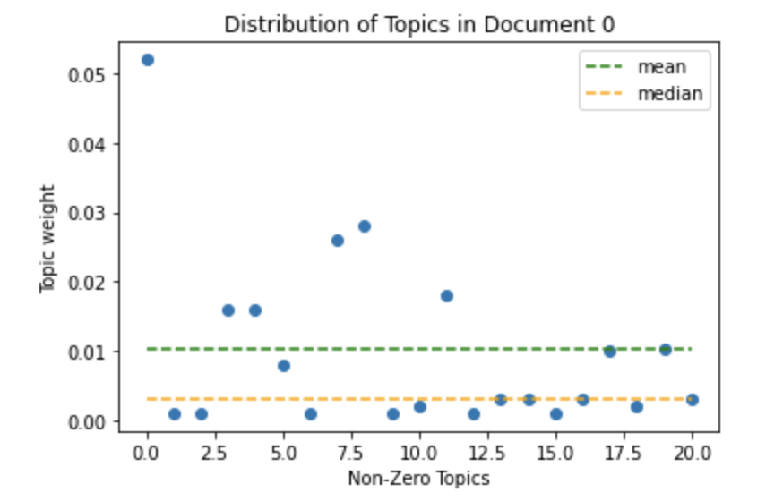
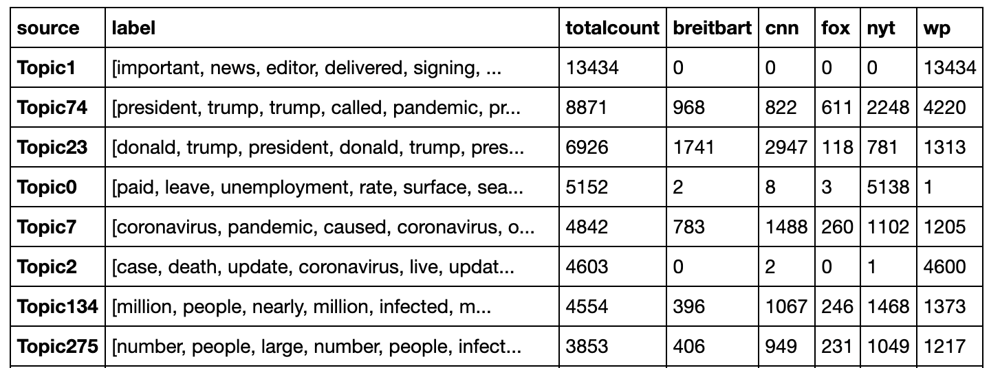
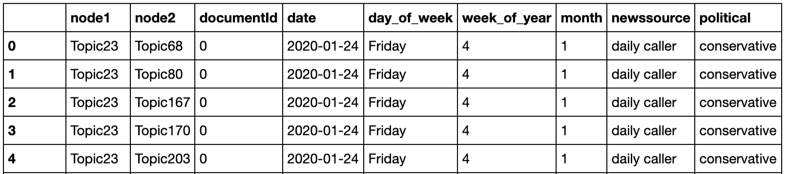
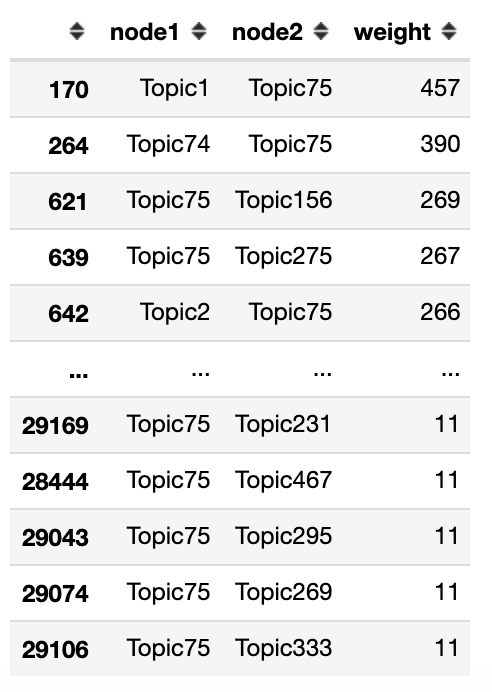

# Surveillance in the COVID-19 Pandemic: An Analysis of Digital Contact-tracing in East Asian Countries

## About This Project
We collected hundreds of thousands of news articles from liberal and conservative news media across five countries: the United States, South Korea, Taiwan, Hong Kong, and Singapore. Working with three different languages (English, Korean, and Chinese), we aimed to analyze the contact-tracing efforts of East Asian countries in comparison to those of the United States. We wanted to understand how each country viewed contact tracing as an effective means of predicting and controlling the disease in the context of some of its harmful consequences, such as infringement of privacy and potential misuse of information.

This project is part of the Big Data Studies Lab, a research group at Seoul National University.

## Organization
There are five folders, one for each country. In each country is a Jupyter notebook with the same name as the country. This is the main notebook with all of the code. 

The following files are large CSV or Pickle files and are therefore maintained using [Git LFS](https://git-lfs.github.com/).

The `models` folder includes the vectors included in the models for topic modeling.

The `proc` folder includes the document term matrix, the node lists, and the edge lists. 

The optional `scripts` folder includes additional scripts I may have used in the scraping process.

The data (raw, cleaned, and processed) are not included in this repo.

## Tools

### Scraping
* [BeautifulSoup4](https://pypi.org/project/beautifulsoup4/)
* [FakeUserAgent](https://pypi.org/project/fake-useragent/)
* Python requests

### Data Cleaning and Processing
* [KoNLPy](https://konlpy.org/en/latest/) (Korean NLP Python package)
* [Soylemma](https://pypi.org/project/soylemma/) (Korean lemmatizer)
* [Korean stop words](https://github.com/stopwords-iso/stopwords-ko)
* [Jieba](https://github.com/fxsjy/jieba) (Chinese text segmentation tool)
* [nltk](https://www.nltk.org/) (used for English stop words, lemmatizer, stemmer)

### Topic Modeling
* [sklearn](https://scikit-learn.org/stable/modules/generated/sklearn.decomposition.NMF.html) (used for NMF, TF-IDF)

### Misc.
* networkx
* matplotlib

## Methodology
All notebooks are arranged in a similar fashion:

### 1. Data Collection (Scraping)
We collected news articles starting on January 1, 2020 until the end of June containing carefully chosen set of keywords. The articles were scraped from news sources chosen to represent both liberal and conservative mainstream news for each respective country. The keywords and news sources were country-specific, and are specified in the below section: [News Sources and Search Terms](#news-sources-and-search-terms). 

### 2. Data Cleaning and Tokenizing
Data cleaning involved removing messy bits, html tags, and stop words. Tokenizing involved breaking up and lemmatizing words or phrases and using a Bag-Of-Words (BOW) approach. These processes were language-specific. More details about the specific tools used can be found in the above section: [Tools](#data-cleaning-and-processing).

### 3. Topic Modeling
We used TF-IDF and NMF to perform topic modeling on the cleaned and tokenized news articles. We performed topic modeling on bigrams. More details about the specific tools used can be found in the above section: [Tools](#data-cleaning-and-processing).

### 4. Network Semantic Analysis of Topics
Since this project was specifically about a network analysis of digital contact tracing, we focused our efforts on selecting the topic that would best represent the "contact tracing" topic. 

Once the "contact tracing" topic was detected, we examined the document-topic matrix (`proc/doc_top_matrix.csv`) resulting from the topic modeling and created a discretized version of the document-topic matrix (`proc/discrete_dtm.csv`). This discretized document-topic matrix was based off of a threshold (usually the mean of the topic) of the weights; the weights of the topics in any given document higher than the mean of all of the topic weights of that document were given a 1, 0 otherwise. In the image below, the green line is the mean, the orange is the median.

Once the document-topic document was discretized, we used this to generate the node list (`proc/node_list.csv`) and edge list (`proc/edge_list.csv`). 

The node list organizes the topics ("nodes") by their total count (how many documents/articles is this topic found in?) as well as their total counts in each news source. Below is a snippet of the node list from the American news sources. You can see that `Topic 1` is entirely dominated by news articles from Washington Post, and so we can assume that this topic is Washington Post specific (in terms of wording, metadata, writing style, etc).

The edge list organizes the topics ("nodes") and their co-occurence ("edges") with other topics in the same articles. This list includes some extra metadata as well, including the date of the article, day of the week, week of the year, month of the year, news source, and political leaning.

### 5. Article Analysis
Using the node list and edge list, we can we can plot the distribution of the node weights, the distribution of the edge weights, and the distribution of the edge weights of only the contact-tracing nodes. This is useful for finding thresholds for the long-tail distribution for the contact-tracing node.

Node Weights (US)             |  Edge Weights (US) | Edge Weights Contact Tracing (US)
:-------------------------:|:-------------------------:|:-------------------------:
  |   | 

Using the third distribution, we can use different thresholds (higher threshold = stronger weight = two topics are more strongly correlated) to find articles in which the contact-tracing node co-occurs with other nodes. In the below example, `Topic 75` is the contact-tracing topic in US News. It shows that `Topic 75` co-occurs most with `Topic 1` (with a weight of 457, which means that `Topic 75` and `Topic 1` appear in 457 articles together), then second-most with `Topic 74`.

For each node-pair in the list beyond a certain threshold, we generate a a collection of articles containing the two nodes. Additionally, we create a list of metadata containing the two node IDs, the edge weight, and the bag-of-words for each node. The articles can be analyzed using the metadata using qualitative methods to determine the connection and significance between the topics.

## News Sources and Search Terms
The following are the news sources and search terms used for each country.
Date range used: January 01, 2020 to the end of June.

### South Korea

* Search terms: `코로나`, `COVID-19`
* Newspapers: [조선일보](http://www.chosun.com/), [중앙일보](https://joongang.joins.com/), [동아일보](https://www.donga.com/), [한겨레](http://www.hani.co.kr/), [경향신문](http://www.khan.co.kr/)
* These were scraped the top results from the [Naver News](https://news.naver.com/) portal.

### United States of America

* Search terms: `COVID-19`, `coronavirus`
* Newspapers: [CNN](https://edition.cnn.com/), [Fox](https://www.foxnews.com/), [New York Times](https://www.nytimes.com/), [Washington Post](https://www.washingtonpost.com/), [Breitbart](https://www.breitbart.com/), [Daily Caller](https://dailycaller.com/)

### Hong Kong
* Chinese search terms: `COVID-19`, `新冠肺炎`
* Chinese Newspapers: [Oriental Daily News (東方日報)](https://orientaldaily.on.cc/), [Ming Pao (明報)](https://www.mingpao.com/), [Sing Tao Daily (星島日報)](https://std.stheadline.com/)
* English search terms: `COVID-19`, `coronavirus`
* English Newspapers: [South China Morning Post’s (SCMP)](https://www.scmp.com/news/hong-kong), [Hong Kong Free Press](https://hongkongfp.com/)

### Taiwan
* Search terms: `COVID-19`, `新冠肺炎`
* Newspapers: [United Daily News](https://udn.com/news/index), [China Times](https://www.chinatimes.com/?chdtv), [Liberty Times](https://www.ltn.com.tw/), [Apple Daily](https://tw.appledaily.com/)

### Singapore
* Search terms: `COVID-19`, `coronavirus`
* [The Straits Times](https://www.straitstimes.com/), [The New Paper](https://www.tnp.sg/)

## Useful Articles

* [Topic Modeling with LDA and NMF on the ABC News Headlines dataset](https://medium.com/ml2vec/topic-modeling-is-an-unsupervised-learning-approach-to-clustering-documents-to-discover-topics-fdfbf30e27df)
* [Topic Modeling and Latent Dirichlet Allocation (LDA) in Python](https://towardsdatascience.com/topic-modeling-and-latent-dirichlet-allocation-in-python-9bf156893c24)
* [Mining English and Korean text with Python](https://www.lucypark.kr/courses/2015-ba/text-mining.html)
* [데이터 사이언스](https://ehfgk78.github.io/2018/01/23/DataScience08-KoNLPy/) - on using KoNLPy
* [말뭉치를 이용한 한국어 용언 분석기](https://lovit.github.io/nlp/2019/01/22/trained_kor_lemmatizer/) - Lemmatizing Korean by using Part-Of-Speech tagging

